# StringStorage Infrastructure Flow Diagram

```mermaid
graph TD
    A[👤 Developer] -->|1. Writes Code| B[💻 Local Development]
    B --> C[📁 StringStorage.sol Contract]
    B --> D[🧪 Test Suite]
    B --> E[⚙️ Hardhat Config]
    
    F[🔑 Environment Variables] --> G[.env File]
    G --> H[🌐 Infura API Key]
    G --> I[🔐 Private Key]
    G --> J[📊 Etherscan API Key]
    
    B -->|2. Compile & Test| K[📦 Hardhat Framework]
    K --> L[✅ Contract Compilation]
    K --> M[🧪 Run Tests]
    
    A -->|3. Deploy Command| N[🚀 Deployment Process]
    N --> O[📡 Infura RPC Endpoint]
    O -->|HTTPS Connection| P[🌍 Sepolia Testnet]
    
    I -->|Signs Transaction| N
    N -->|Deploy Transaction| P
    P -->|Returns| Q[📋 Contract Address]
    Q --> R[0xe079...3094]
    
    A -->|4. Verify Contract| S[🔍 Etherscan Verification]
    J --> S
    S -->|Upload Source Code| T[📊 Etherscan Platform]
    T --> U[✅ Verified Contract]
    
    V[👥 Public Users] -->|5. Interact| W[🌐 Etherscan Interface]
    W -->|Read Functions| U
    W -->|Connect Wallet| X[🦊 MetaMask]
    X -->|Write Functions| Y[💰 Gas Payment]
    Y --> P
    
    P --> Z[📚 Blockchain State]
    Z --> AA[🔒 Immutable Storage]
    
    style A fill:#e1f5fe
    style P fill:#f3e5f5
    style U fill:#e8f5e8
    style AA fill:#fff3e0
    
    classDef infra fill:#f9f,stroke:#333,stroke-width:2px
    classDef blockchain fill:#bbf,stroke:#333,stroke-width:3px
    classDef user fill:#bfb,stroke:#333,stroke-width:2px
    
    class H,I,J,O,T infra
    class P,Z,AA blockchain
    class A,V user
```



## Infrastructure Components

### 1. Development Environment
- **Local Machine**: Where StringStorage.sol is developed
- **Hardhat Framework**: Compilation, testing, and deployment toolkit
- **Node.js & npm**: Runtime and package management

### 2. External Services
- **Infura**: Ethereum node provider (RPC endpoint)
  - URL: `https://sepolia.infura.io/v3/YOUR_PROJECT_ID`
  - Handles blockchain communication
- **Etherscan**: Block explorer and contract verification platform
  - Provides contract interaction interface
  - Source code verification

### 3. Authentication & Security
- **Private Key**: Signs all transactions
- **MetaMask**: User wallet for contract interaction
- **Environment Variables**: Secure credential storage

### 4. Blockchain Infrastructure
- **Sepolia Testnet**: Ethereum test network
- **Smart Contract**: Deployed at `0xe079324c4095E9108EDf669c6A714a7CE1063094`
- **Immutable Storage**: Permanent on-chain data storage

## Data Flow

1. **Development Phase**
   - Write contract locally
   - Compile with Hardhat
   - Run comprehensive tests

2. **Deployment Phase**
   - Hardhat connects to Infura RPC
   - Private key signs deployment transaction
   - Contract deployed to Sepolia blockchain
   - Returns contract address

3. **Verification Phase**
   - Source code uploaded to Etherscan
   - Bytecode verification
   - Public interface becomes available

4. **Interaction Phase**
   - Users access via Etherscan interface
   - MetaMask handles transaction signing
   - Gas fees paid for state changes
   - Reads are free, writes cost gas

## Security Considerations

- **Private Key**: Never committed to version control
- **Environment Variables**: Stored securely in `.env` file
- **Access Control**: Only owner can modify contract state
- **Testnet**: No real ETH at risk during development
- **Verification**: Public source code ensures transparency

## Network Architecture

```
Developer Machine
    ↓ (HTTPS)
Infura RPC Node
    ↓ (P2P)
Sepolia Network
    ↓ (Storage)
Ethereum Blockchain State
```

This infrastructure provides a secure, transparent, and efficient pathway from local development to live blockchain deployment.
